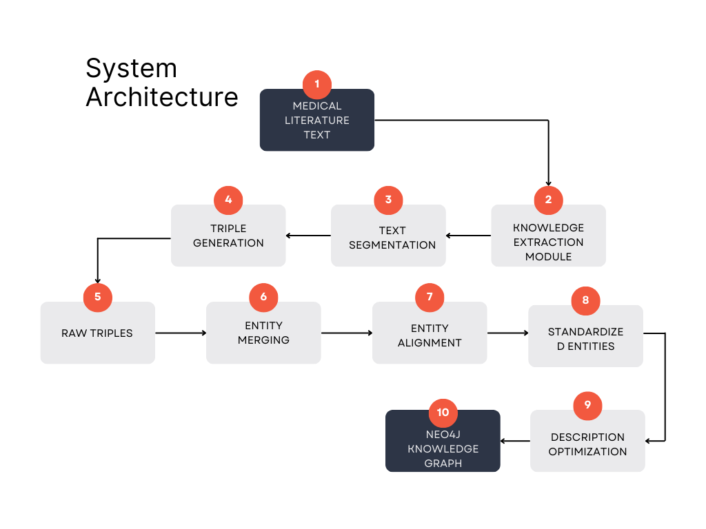

# **Alzheimer's Disease Knowledge Graph Extraction and Construction System**

This project is designed to **automatically extract knowledge graphs** related to **Alzheimer's disease** from **medical literature** and structure them into a **knowledge base**. 

### **Project Highlights:**
- **Reliable entity type descriptions** are established to **avoid divergence** in the knowledge graph.
- **Reliable relationship types** are defined according to **our extraction description [extract_description.txt](extract_description.txt)**.
- **Levenshtein distance** is applied to **remove duplicate or highly similar relationships**, ensuring a clean and consistent knowledge structure.


## **System Architecture**



## **File Descriptions**

### **1. Extraction Script (`extra_multiprocess.py`)**
- **Function**: Extracts knowledge triples in parallel using multiprocessing.
- **Input**: Text files from the `dats` directory.
- **Output**: CSV files stored in the `results` directory.
- **Features**:
  - **Supports resuming from the last checkpoint.**
  - **Processes data in parallel with multiple processes.**
  - **Automatically partitions large files for processing.**
  - **Generates detailed log records.**

### **2. Merging Script (`merge_results.py`)**
- **Function**: Merges all extracted results.
- **Input**: All `*_triples.csv` files from the `results` directory.
- **Output**: `results/merged_knowledge_triples.csv`
- **Features**:
  - **Automatically removes duplicates.**
  - **Standardizes relationship names.**
  - **Analyzes and categorizes entity types.**

### **3. Entity Merging Script (`merge_entity_types.py`)**
- **Function**: Merges similar entities and entity types.
- **Input**: `results/merged_knowledge_triples.csv`
- **Output**: `results/merged_knowledge_triples_smart.csv`
- **Features**:
  - **Merges entities based on string similarity.**
  - **Ensures semantic consistency.**
  - **Generates a detailed merging report.**

### **4. Description Collection Script (`collect_descriptions.py`)**
- **Function**: Organizes and optimizes triple descriptions.
- **Input**: CSV files from the `results` directory.
- **Output**: `results/knowledge_triples_with_descriptions.csv`
- **Features**:
  - **Collects all descriptions.**
  - **Selects the best description.**
  - **Removes redundant descriptions.**

### **5. Neo4j Import Script (`import_to_neo4j.py`)**
- **Function**: Imports the knowledge graph into a Neo4j database.
- **Input**: `results/merged_knowledge_triples_smart.csv`
- **Features**:
  - **Automatically creates nodes and relationships.**
  - **Supports resuming from failed imports.**
  - **Provides import statistics.**

## **Installation**

1. Install **Python 3.9+**
2. Run:
   ```bash
   pip install -r requirements.txt
   ```
3. Change the **Neo4j** credentials to:
   ```
   neo4j/123456
   ```
4. Execute:
   ```bash
   python import_to_neo4j.py
   ```

## **Execution Order**

1. **Knowledge Extraction**
   ```bash
   python extra_multiprocess.py
   ```

2. **Result Merging**
   ```bash
   python merge_results.py
   ```
   - **Check the `merged_knowledge_triples.csv` file.**

3. **Entity Merging**
   ```bash
   python merge_entity_types.py
   ```
   - **Check the `merged_knowledge_triples_smart.csv` file.**

4. **Description Organization**
   ```bash
   python collect_descriptions.py
   ```
   - **Check the `knowledge_triples_with_descriptions.csv` file.**

5. **Neo4j Import**
   ```bash
   python import_to_neo4j.py
   ```
   - **Verify the data in the Neo4j database.**

## **Directory Structure**

```plaintext
README.md
.
├── dats/                      # Directory for input text files
├── results/                   # Directory for output results
├── extra_multiprocess.py      # Knowledge extraction script
├── merge_results.py           # Result merging script
├── merge_entity_types.py      # Entity merging script
├── collect_descriptions.py    # Description collection script
├── import_to_neo4j.py         # Neo4j import script
└── README.md                  # Documentation
```

## **Important Notes**

1. **Before execution, ensure:**
   - The **Neo4j database** is running.
   - All required **Python packages** are installed.
   - The **directory structure** is correct.

2. **Recommended execution steps:**
   - **Verify output after each step.**
   - **Ensure data quality.**
   - **Retain intermediate files for reference.**

3. **Error Handling:**
   - **Check log files for details.**
   - **Resume execution from failure points if needed.**
   - **Maintain data consistency.**


